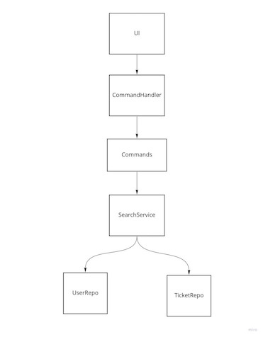

# Search Application
This is an application which enables for user to search users and tickets with term and value.


## Environment
* Python
* Recommended python version - 3.9
* test framework - pytest
* type checking - mypy
* Docker
    - Recommend to use dockerised scripts to run app and test

## How to run test

```bash
$ ./script/test.sh
```

## How to run application

```bash
$ ./script/run.sh
```

## Design models
* RepoBuilder - This builds data structure to make searchable with fields of repo data
* UserRepo - As Users Repository it stores a data structure. And it provides methods to search
* TicketRepo - As Tickets Repository it stores a data structure. And it provides methods to search
* SearchService - This implements search logics for search requests
* CommandHandler - As UI sends a command it creates a command and run it.
* Commands - It calls search service to search results and returns results to ui.
* UI - It gets inputs and parses command string and args according to inputs to send them to command handler. And it displays command result.


## Data structure for repo
Repo data has two hashmap tables. One table stores raw data as objects with _id key. The other table is indexing table which of key is field name and value is sub hashmap table which of key is field's value and value is a list of _ids.
eg)
```
{
    "1": {"_id": 1, "name": "james"}
    "2": {"_id": 2, "name": "lee"}
}

{
    "name": {"james": ["1"], "lee": ["2"]}
}
```
This data structure gives O(n) complexity for searching by using hashmap. But it requires more memory and building time and complexity compared with having list of records.


## Assumptions
* _id of users and tickets are unique as primary key
* Optional fields:
    * User: verified
    * Ticket: type, assignee_id
* Empty string will be used to search missing values
* Full value matching and case-insensitive searching
* user and ticket data are embedded in application. App does not support to change data.

## Design decisions
* Repository for ticket and user
    - The responsibility of this module is storing a data structure with indexing so that it gives performant searching capability to search service
* SearchService
    - The responsibility of this module implements searching logic and result's views as models so that it can implement requirements of searching results without dependency on Repository module and Command module. For example, if user has new fields, user repo and model will be updated. But search service don't need to update for that. If searching users need to show just users, searching service and result model will be updated but no change is required for Repository and Command


## Trade offs
| what | cons | pros |
|---|---|---|
|RepoBuilder will update indexed map data structure for each field|It requires calling building function multiple times, so it will take more time compared with building all fields indexed map with one building call|It can just store required fields indexed map, so it could save memory.|


## How to run application


